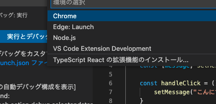

# \[React]\[TypeScript] Hello World的なもの(2022年1月版)(^^;)

[\[React\]\[TypeScript\] Hello World的なもの(1)(更新！)](https://m-miya.blog.jp/archives/1068770013.html)が古くなってたので更新した。

次のページを参考にして構築してみた。(抜けてたらスマン)
- [最新版TypeScript+webpack 5の環境構築まとめ(React, Vue.js, Three.jsのサンプル付き) - ICS MEDIA](https://ics.media/entry/16329/)
- [Webpack５ 設定② - Qiita](https://qiita.com/zgoovw_/items/7d964694a406f39a9739)
- [【webpack5】静的ファイルの公開設定にAsset Modulesを使う｜MarsquaiBlog](https://marsquai.com/745ca65e-e38b-4a8e-8d59-55421be50f7e/99181429-1958-4966-90c1-2e9357ecf450/9c23df88-0922-49c6-b4c1-20050cc1e91e/)
- [最新版で学ぶwebpack 5入門 - JavaScriptのモジュールバンドラ - ICS MEDIA](https://ics.media/entry/12140/)
- [今時のwebpackの構成 - Qiita](https://qiita.com/kmatae/items/fa99c131756802a63852)

## インストール
プロジェクトのフォルダをmkdirとか使って作る。ここでは"helloworld"にしとく。

helloworldに移動してpackage.jsonを作る。

~~~bash
$ npm init
~~~

質問には適当に答える。

使用するモジュールをインストールする。

~~~bash
$ npm install react react-dom --save
$ npm install @types/node @types/react @types/react-dom html-loader html-webpack-plugin ts-loader typescript webpack webpack-cli webpack-dev-server webpack-merge --save-dev
~~~

tsconfig.jsonを作る。

~~~bash
$ npx tsc --init
~~~

## ソースを用意する。

srcフォルダを作って、App.tsx、index.html、index.tsxを用意する。

App.tsx
~~~typescript
import React from "react";

export const App = ()=>{
    const [message, setMessage] = React.useState("ボタンをおして！");

    const handleClick = () => {
        setMessage("こんにちは！");
    }
    return 

        
{message}

        
<button onClick={handleClick}>ボタン</button>

    
;
}
~~~

index.html
~~~html
<!DOCTYPE html>
<html lang="ja">
    <header>
        <meta charset="utf-8">
        <!-- app.jsなどのjsファイルを読み込む部分のタグは
            webpackのhtml-loaderプラグインで勝手に
            追加してくれるので記述しない。 -->
    </header>
    <body>
        

    </body>
</html>
~~~

index.tsx
~~~typescript
import * as React from 'react';
import * as ReactDOM from 'react-dom';
import { App } from "./App";

ReactDOM.render(
    <App />,
    document.getElementById('root')
);
~~~

## 設定ファイルを用意する。

package.jsonを変更する。

main、scriptsを次のように変更する。

scriptsの内容は
- "npm run build"でデバッグ用のビルド
- "npm run build:prod"でリリース用のビルド
- "npm run start"でWebサーバーの起動とWebページの表示andソースを監視して変更があればビルドと再表示を行う。
- "npm run watch"でソースを監視して変更があればビルドを行う。

~~~json
  ... (省略)
  "main": "dist/app.js",
  "scripts": {
    "build": "npx webpack --config webpack.config.dev.js",
    "build:prod": "npx webpack",
    "start": "npx webpack serve --config webpack.config.dev.js",
    "watch": "npx webpack --watch --config webpack.config.dev.js"
  },
  ... (省略)
~~~

tsconfig.jsonをつぎのようにオプションを変更する。

~~~json
{
  "compilerOptions": {
    "target": "es5",
    "lib": ["es2020", "DOM"],
    "jsx": "react",
    "module": "es2015",
    "moduleResolution": "node",
    "esModuleInterop": true,
    "forceConsistentCasingInFileNames": true,
    "strict": true,
    "skipLibCheck": true
  }
}
~~~

webpackのファイルを用意する。webpack.config.jsはリリースようでwebpack.config.dev.jsはデバッグ用、webpack.config.common.jsはそれぞれの共通部分になる。webpack実行時にwebpack-mergeで共通部分の内容にそれぞれのファイルでの内容がマージされて実行される。

webpack.config.js
~~~javascript
const {merge} = require('webpack-merge');
const common = require('./webpack.config.common');

module.exports = merge(common, {
    mode: 'production',
});
~~~

webpack.config.dev.js
~~~javascript
const {merge} = require('webpack-merge');
const common = require('./webpack.config.common');

module.exports = merge(common, {
    mode: 'development',
    // ソースマップを有効にする
    devtool: 'source-map',
});
~~~

webpack.config.common.js
~~~javascript
const path = require('path');
const HtmlWebpackPlugin = require('html-webpack-plugin');

module.exports = {
    // メインとなるJavaScriptファイル（エントリーポイント）
    entry: {
        app:'./src/index.tsx',
    },
    // ファイルの出力設定
    output: {
        path: path.resolve(__dirname, "dist"),
        filename: '[name].js',
    },
    target: ['web', 'es5'],
    module: {
        rules: [
            {
                // 拡張子 .ts もしくは .tsx の場合
                test: /\.tsx?$/,
                // TypeScript をコンパイルする
                use: 'ts-loader'
            },
            {
                // 拡張子.htmlの場合
                test: /\.html$/i,
                loader: 'html-loader',
            },
            {
                test: /\.(eot|svg|ttf|woff|woff2|png|jpg|gif)$/i,
                type: 'asset/resource',
            }
        ]
    },
    // import 文で .ts や .tsx ファイルを解決するため
    resolve: {
        extensions: [
            '.ts', '.tsx', '.js', '.jsx', '.json'
        ],
    },

    // webサーバーの設定
    devServer: {
        static: "dist",
        port: 8080,
        open: true,
    },

    // htmlファイルの設定
    plugins: [
        new HtmlWebpackPlugin({
            template: './src/index.html',
        })
    ],

    optimization: {
        splitChunks: {
          chunks: "all",
          minSize: 0,
          // node_modulesのjsを別ファイル(vendors.js)に出力するように設定
          cacheGroups: {
            vendor: {
              name: "vendors",
              test: /[\\/]node_modules[\\/]/,
              priority: -10,
            },
            default: false,
          },
        },
    }
};
~~~

## Visual Studio Codeでデバッグする。

Visual Studio Codeで"helloworld"フォルダを開く。

左にある"実行とデバッグ"を選択すると次のような画面になるので、

"launch.jsonファイルを作成します。"をクリックすると、次のような選択画面が表示されるので"Chrome"を選択する。

App.tsxにブレイクポイントを設定して、↓ここを押すとデバッグできる。

[github](https://github.com/miyamoto999/helloworld_ts/tree/V1)にコードを投稿しておいた。