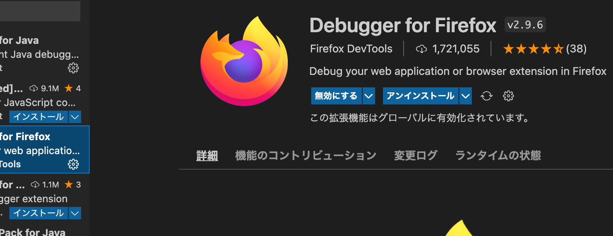
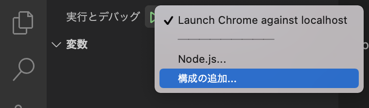
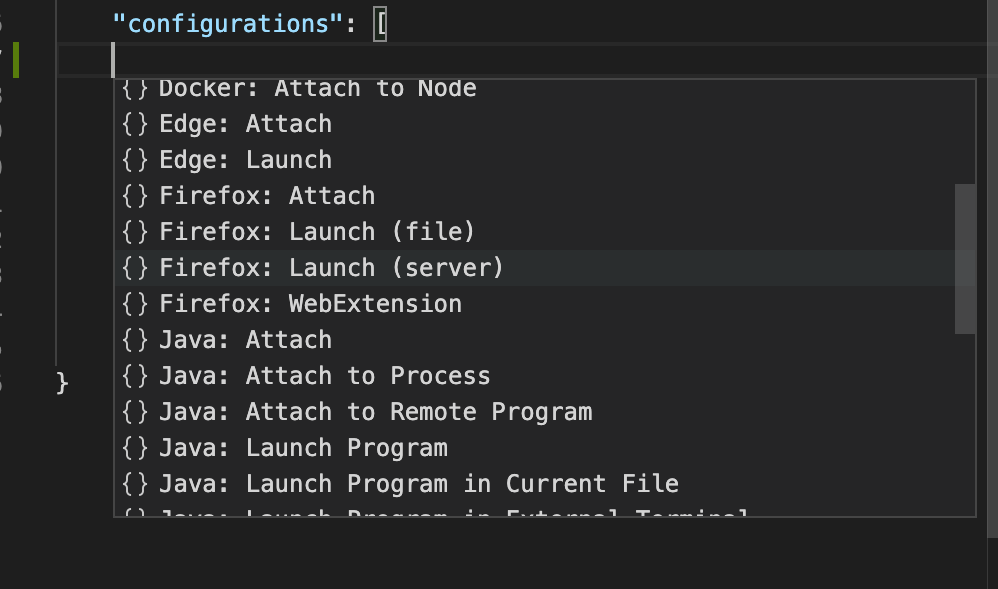
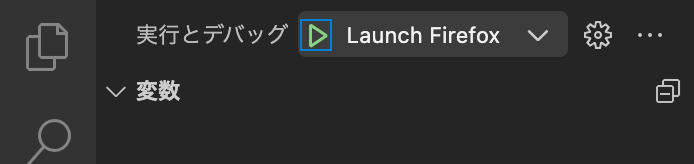
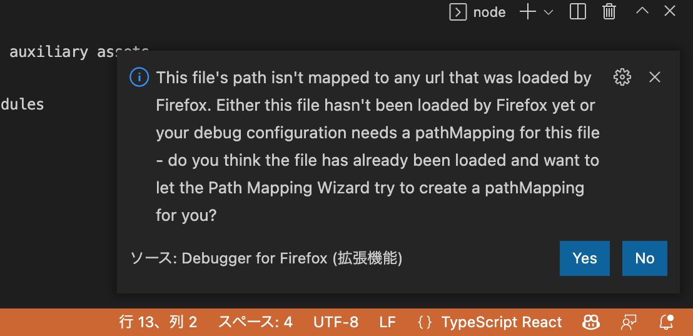

# \[React]\[TypeScript] Hello World的なもの(2022年1月版)(^^;)(2) Firefoxでデバッグしてみる。

[\[React\]\[TypeScript\] Hello World的なもの(2022年1月版)(^^;)](https://m-miya.blog.jp/archives/1079368991.html) ではChromeを使ってデバッグする方法を最後に書いたけど、今回はFireFoxを使う方法を書く。ChromeOSのLinux開発環境でChromeを使ってデバッグができなかったんで試してみた感じだ。

まず、VSCodeにdebugger for FireFox拡張機能を追加する。

実行とデバッグで構成の追加を行う。

次のような画面になるので"Firefox: Launch (server)"を選択する。

と、launch.jsonにコードが追加されるのでname、urlを変更する。(nameは変更しなくてもいいけど、Launch localhostでわかりにくいので変更する)

~~~json
            "name": "Launch Firefox",
            "url": "http://localhost:8080",
~~~

webサーバーを"npm run start"で起動しておく。

実行とデバッグで"Launch Firefox"を選択し、実行する。

ソースコード上のどこかにブレイクポイントを設定すると、次のような画面がでるのでYesを選択する。

launch.jsonのFirefox関係の設定部部に次のような設定が追加される。

~~~json
            "pathMappings": [
                {
                    "url": "webpack://helloworld/src",
                    "path": "${workspaceFolder}/src"
                }
            ]
~~~

ここでデバッグをリスタートすると設定したブレイクポイントで止まるようになる。

[github](https://github.com/miyamoto999/helloworld_react/tree/V2)にコードを投稿しておいた。